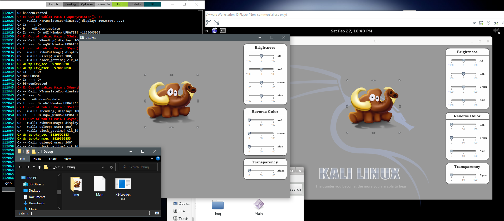
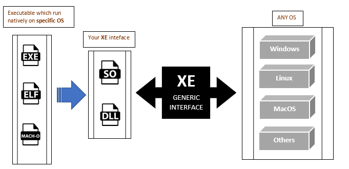

#

_Load & run executable [Windows EXE / Linux ELF / & more] anywhere, without any dependency_
# 

**XE-Loader** is a **C99** _open source project_. Like the well known [Wine](https://www.winehq.org/), this loader runs executable directly on the system without any virtualization layer.

_No extra layers = No penalties_ 

Instead of trying to replicate a whole OS, our goal is to give maximum controls to the user. 

This way, we are focusing more on creating a portable executable. We mean ... **Really portable**. Because of all those OS relative function calls, break the fact that we cannot use the same binary and run it anywhere.

So we create a Linux app, Windows app, etc, then we try to find somewhat equivalent for each version of your app. Your app depends on the system.

What about if it's the system that depends on your app? _This is a very different perspective._

If we take the 3 executable file formats ELF, PE, Mach-O all of these are compatible architecture. In reality, your app is already compatible with these 3 OS, behind the format, all was using the same x86 instructions.

 

Therefore, can we run **Elf file on Windows**? Yes it's possible: 

That said, XE-Loader will not run every existing executable, instead, it gives you control: 

* **Relink** all dynamique function you want (_Change behavior_)
* **Restrict** system access (_Better protection_) 
* **View** functions flow and debug with gdb (_View every part of your program_)

## Real world application

* Create **true cross-platform** binary
* Perfect fit for **OS developement** (no external dependency required)
* Create true portable **Toolchain**
* Load & run .exe file directly **from memory** (no file is even required)
* **Pack**, perform compression and perform pre-operation before running it
* & more

## Generic Interface

[*_Can I still call a specific OS function depending on the platform?_](wiki/Call_Specific_OS_Function.md)

## New File Format

## How to build?

[See our wiki](https://github.com/VLiance/XE-Loader/wiki)

## How to create an XE-Loader compatible binary?

[See our wiki](https://github.com/VLiance/XE-Loader/wiki)

## Examples

Created for the [CpcDos](https://cpcdos.net ) project.

## Soon

* Support Android (.apk)
* Support MacOS   (.app)

## Even further

Here we can make **cross-platform** binary that run on specific architecture, if we want to go even further and use the LLVM IR technologie, we can make **cross-architecture** binary (_Same XE file everywhere_)

