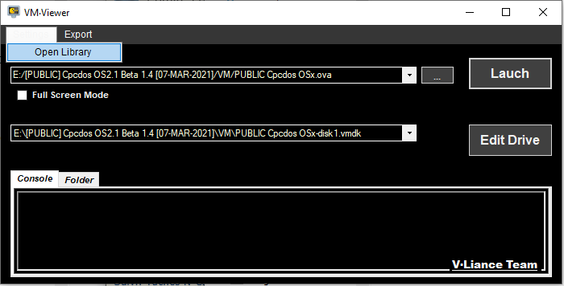
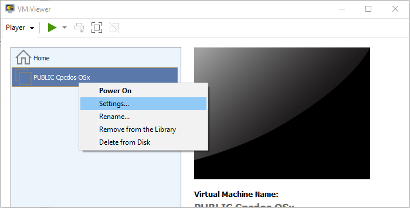
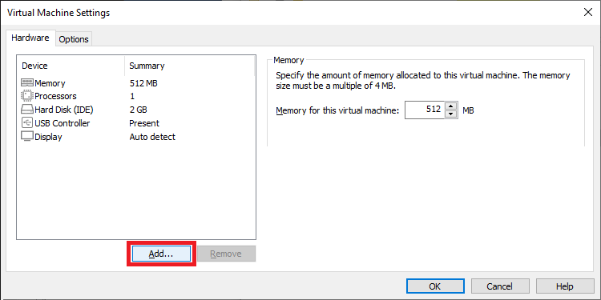
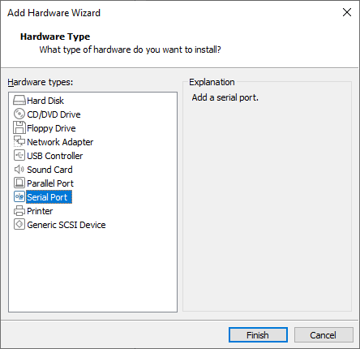
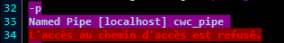
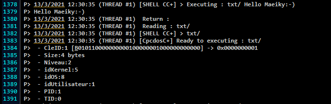
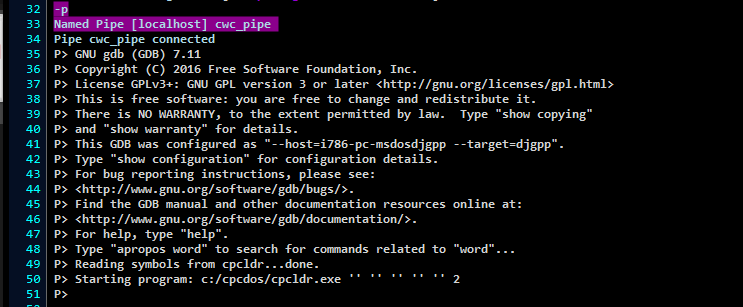

## Comment communiquer avec la VM CpcDos à l'aide d'un 'Pipe'

### Prérequis

* [Une VM CpcDos ".ova"](https://cpcdos.net/fr/download)
* [VM-Viewer (VmWare)](https://github.com/VLiance/VW_Viewer)
* [CWC](https://github.com/VLiance/Cwc)

***

1.-Lancer le .ova avec VM-Viewer

2.-Ouvrir la librairie




3.-Ouvrir la configuration




4.-Ajouter un composant hardware




5.-Sélectionner le "Serial Port"




6.- Utiliser un "named pipe", la VM comme serveur, avec une application comme client. Le nom doit obligatoirement commencer par **\\\\.\pipe\**

Ici, on va utiliser le nom "cwc_pipe", ce qui donne: **\\\\.\pipe\cwc_pipe**


7. Voilà, valider les changements et le port de communication est prêt!


### Rediriger le output de CpcDos

1. Lancer la VM 
2. Dans la console CpcDos, exécuter les commandes suivantes:

```
SYS/ /DEBUG /COM /INIT
SYS/ /DEBUG = 1
SYS/ /DEBUG /CPINTICORE = 1
SYS/ /DEBUG /COM1 = 2
```
Ceci active et redirige le debug vers le **COM1**

> À noter que cette ligne 'SYS/ /DEBUG /COM1 = 2' peut ralentir l'OS, car les trames ont un délai d'envoie 
> 
> (Solution possible: filtrer vos messages)

### Activer le pipe sous CWC

1. Lancer CWC

2. Executer la commande "-p" (le 'Named pipe' par défaut est **cwc_pipe**)


3.Vérifier que le message "_Pipe cwc_pipe connected_" apparaît

* S'il ne s'affiche pas et qu'il n'y a pas d'erreur c'est probablement que le port est déjà utilisé, ou bien mal configuré

* S'il y a cette erreur, c'est probablement que vous devez exécuter la VM en admin:



3. Maintenant tout les information debug devrait s'afficher:




### Rediriger le **stdout** du **SDK**

1. Le **stdout** est gérer directement via le DOS. Il faut l'activé avec une redirection "**> COM1**"

2. Avec le **SDK** il est fortement conseiller de le charger avec GDB pour un meilleurs contrôle et débogueur:

* Dans "CPCDOS/DRIVERS/DOS/EXEC.BAT" il est possible d'ajouter ceci, à la fin du fichier pour charger automatiquement gdb vers le COM1:

```
call gdb -ex run --args cpcldr "%1" "%2" "%3" "%4" "%5" > COM1
```

3. Résultat:



***

### Have fun!

***
